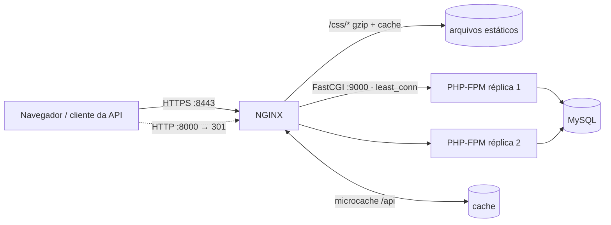

# Agenda de Eventos


Projeto-base da **Mentoria CREMESP · PHP Moderno** — trilha DevOps (semanas 1 a 6).

É uma aplicação PHP **propositalmente pequena** (sem framework) para cadastro e consulta de eventos.
O foco da trilha não é o código da aplicação, e sim tudo o que acontece em volta dele:
versionamento, containers, pipelines de CI/CD e NGINX. A cada semana você vai evoluir este repositório com uma nova tarefa.

> A estrutura de pastas imita a de um projeto Laravel (`public/index.php` como ponto de entrada,
> `composer.json`, `tests/`), então tudo o que construirmos aqui vale também para aplicações Laravel.

> **Primeiro acesso?** Siga o [Guia de preparação do ambiente](https://gist.github.com/tiagolpadua/bf92e5c21947eb658bae03229cc753f2): o que instalar, como criar o seu repositório a partir deste template e como rodar o projeto.

## Autor

Tiago Pádua — repositório criado na semana 1 da mentoria (fluxo issue → branch → PR).

## Funcionalidades

| Rota | Método | O que faz |
|---|---|---|
| `/` | GET | Lista os eventos e mostra o formulário de cadastro |
| `/eventos` | POST | Cadastra um evento |
| `/api/eventos` | GET | Lista os eventos em JSON |
| `/api/eventos/{id}` | GET | Retorna um evento em JSON |
| `/health` | GET | Verificação de saúde (banco + nome da instância) |

**Busca (feature toggle):** com `FEATURE_BUSCA=true`, a página inicial mostra um campo de busca, e `/?q=termo` e `/api/eventos?q=termo` filtram por título ou local. Veja o [CONTRIBUTING.md](CONTRIBUTING.md).

Toda resposta traz o cabeçalho `X-App-Instance` com o nome da máquina/container que respondeu —
vai ser útil quando colocarmos várias réplicas atrás de um balanceador.

## Como executar

### Opção 1 — PHP instalado na máquina (8.3 ou superior)

```bash
composer install          # instala o PHPUnit (dependência de desenvolvimento)
composer serve            # sobe em http://localhost:8000
composer test             # roda os testes
bin/smoke-test.sh         # verifica a aplicação no ar (padrão: http://localhost:8000)
```

> Sem Composer? Dá para só ver a aplicação funcionando com `php -S localhost:8000 -t public`.

### Opção 2 — GitHub Codespaces (nada para instalar)

No seu repositório: **Code → Codespaces → Create codespace on main** e, no terminal, rode os mesmos comandos da opção 1.

### Opção 3 — Docker (NGINX + PHP-FPM + MySQL)

```bash
cp .env.example .env                 # ajuste DOCKERHUB_USER e as senhas
bin/gerar-certificado.sh             # certificado TLS autoassinado (só na primeira vez)
docker compose up -d --build         # https://localhost:8443 (http://localhost:8000 redireciona)
docker compose ps                    # nginx/app/db "healthy", migracao "exited (0)"
INSEGURO=1 bin/smoke-test.sh https://localhost:8443
docker compose down                  # para tudo, mantendo os dados no volume
```

> O navegador vai avisar que o certificado não é confiável (é autoassinado). Para um certificado
> confiável na sua máquina, use o [mkcert](https://github.com/FiloSottile/mkcert) gerando
> `nginx/certs/agenda.crt` e `nginx/certs/agenda.key`.

A imagem da aplicação roda **PHP-FPM** (FastCGI, porta 9000): ela não atende HTTP sozinha, e sim através do NGINX.

## Arquitetura (com Docker Compose)



| Papel do NGINX | Onde ver |
|---|---|
| Terminação HTTPS (HTTP/2) | `http://localhost:8000` → `301` → `https://localhost:8443` |
| Servidor web | `/css/app.css` vem direto do NGINX (sem `X-App-Instance`), com gzip e `Cache-Control` |
| FastCGI | O NGINX fala com o PHP-FPM na porta 9000 ([`nginx/fastcgi-agenda.conf`](nginx/fastcgi-agenda.conf)) |
| Load balancer | `least_conn` entre as réplicas: `X-App-Instance` muda (`docker compose up -d --scale app=3`) |
| API gateway | `/api/v1/eventos` → `/api/eventos` e rate limit de 10 req/s por IP (`429` em JSON) |
| Cache | Respostas da API guardadas por 10 s: `X-Cache-Status: MISS → HIT`, e `STALE` se o PHP cair |

Verifique com `bin/verificar-nginx.sh`. A configuração está em [`nginx/templates/default.conf.template`](nginx/templates/default.conf.template).

## Pipeline (CI/CD)

Cada PR roda os **testes** (PHP 8.3 e 8.4) e o **aceite** (NGINX + PHP-FPM + MySQL via Compose, smoke test e verificação do NGINX).
Cada merge na `main` publica a imagem em `ghcr.io/<usuario>/<repositorio>`, implanta em **homologação** e, após aprovação, em **produção**.
Detalhes em [docs/pipeline.md](docs/pipeline.md).

## Banco de dados

Por padrão a aplicação usa **SQLite** (arquivo em `var/data/agenda.sqlite`, criado automaticamente com 3 eventos de exemplo).
Para usar outro banco, defina variáveis de ambiente:

| Variável | Exemplo |
|---|---|
| `DB_DSN` | `mysql:host=db;port=3306;dbname=agenda;charset=utf8mb4` |
| `DB_USER` | `agenda` |
| `DB_PASSWORD` | `segredo` |
| `MIGRAR_AO_INICIAR` | `false` para **não** criar as tabelas na primeira requisição (aí use `php bin/migrar.php`) |

## Estrutura

```
bin/             comandos de linha (migrar.php, smoke-test.sh, verificar-nginx.sh, gerar-certificado.sh)
nginx/           configuração do NGINX (template, FastCGI, cache e certificados)
docker/          configuração do PHP-FPM e do OPcache usada na imagem
docs/            documentação (desenho do pipeline)
public/          ponto de entrada (index.php) e arquivos estáticos (css)
src/             código da aplicação (namespace App\)
templates/       HTML das páginas
tests/           testes automatizados (PHPUnit)
var/data/        banco SQLite local (ignorado pelo Git)
```

## Tarefas da mentoria

Clique no tema para abrir as atividades da semana (publicadas após cada mentoria).

| Semana | Tema | Tarefa |
|---|---|---|
| 1 | [GitHub](https://gist.github.com/tiagolpadua/920dd0c9cec883bb9c816c879f4adfd9) | ✅ Fluxo issue → branch → PR, conflito, Dependabot e primeira Action |
| 2 | Docker | ✅ Dockerfile multi-stage, Compose com MySQL e volume, imagem no Docker Hub |
| 3 | Integração e entrega contínua | ✅ Desenho do pipeline ([docs/pipeline.md](docs/pipeline.md)), regras de contribuição, feature toggle e smoke test |
| 4 | GitHub Actions | ✅ Pipeline CI/CD completo, imagem no GHCR, environments com aprovação, ruleset na `main` |
| 5 | NGINX: proxy reverso e API gateway | ✅ NGINX na frente de 2 réplicas: estáticos, proxy reverso, load balancer, `/api/v1` e rate limit |
| 6 | NGINX: FastCGI, cache e HTTPS | ✅ PHP-FPM via FastCGI, `least_conn`, gzip, microcache, HTTPS com HTTP/2 |
