# Pipeline de entrega: Agenda de Eventos

> Desenho feito na semana 3 e implementado na semana 4 em [`.github/workflows/ci.yml`](../.github/workflows/ci.yml).

## Objetivo

Toda mudança que chega à `main` deve estar **pronta para ir para produção**, ou seja, *entrega contínua*.
A ida para produção é **automática até homologação** e **aprovada manualmente** para produção.
Isso é entrega contínua, e não *deploy contínuo*. Ver a seção [Decisões](#decisões).

## Visão geral

```mermaid
flowchart LR
    PR[Pull request] --> C1

    subgraph Commit["1 · Estágio de commit (todo PR e push)"]
        C1[Lint<br/>php -l] --> C2[Testes<br/>PHPUnit] --> C3[Build da<br/>imagem Docker]
    end

    C3 -->|merge na main| A1

    subgraph Aceite["2 · Estágio de aceite (main)"]
        A1[Sobe app + MySQL<br/>docker compose] --> A2[Smoke test<br/>bin/smoke-test.sh] --> A3[Publica imagem<br/>tag = SHA do commit]
    end

    A3 --> H[3 · Deploy em<br/>homologação<br/>automático]
    H --> H2[Smoke test<br/>em homologação]
    H2 --> P{Aprovação<br/>manual}
    P -->|aprovado| PR2[4 · Deploy em<br/>produção]
    PR2 --> PR3[Smoke test<br/>em produção]
```

## Estágios

| # | Estágio | Quando roda | O que faz | Tempo-alvo | Se falhar |
|---|---|---|---|---|---|
| 1 | **Commit** | Todo PR e todo push | Lint, testes unitários e de rotas, build da imagem | < 5 min | PR **bloqueado** (não pode fazer merge) |
| 2 | **Aceite** | Merge na `main` | Sobe app + MySQL com o Compose, roda o smoke test e publica a imagem com a tag do commit | < 10 min | `main` vermelha: **prioridade do time** é consertar ou reverter |
| 3 | **Homologação** | Automático após o estágio 2 | Implanta a imagem publicada e roda o smoke test no ambiente | < 5 min | Não segue para produção |
| 4 | **Produção** | Após **aprovação manual** | Implanta **a mesma imagem** testada em homologação e roda o smoke test | < 5 min | **Rollback**: reimplanta a imagem anterior |

## Princípios

- **Construa uma vez, implante muitas.** A imagem é gerada uma única vez no estágio 2 e promovida entre ambientes. O que muda entre ambientes são só as **variáveis de ambiente**.
- **Falhe rápido.** Os testes mais rápidos rodam primeiro.
- **A `main` está sempre verde.** Build quebrado se conserta em minutos ou se reverte (`git revert`).
- **Tudo versionado.** Código, `Dockerfile`, `compose.yaml` e workflows ficam no repositório.

## Ambientes e configuração

| Variável | Desenvolvimento | Homologação | Produção |
|---|---|---|---|
| `DB_DSN` | SQLite local ou MySQL do Compose | MySQL de homologação | MySQL de produção |
| `DB_PASSWORD` | `.env` local | *secret* do ambiente | *secret* do ambiente |
| `FEATURE_BUSCA` | `true` | `true` | `false` até a liberação |

## Estratégia de release

- **Feature toggles:** funcionalidades em andamento entram na `main` **desligadas** (ex.: `FEATURE_BUSCA`). A liberação é uma mudança de configuração, não de código.
- **Rollback:** como cada imagem tem a tag do commit, voltar é reimplantar a tag anterior.
- **Futuro:** com o NGINX como balanceador (semana 5), dá para fazer um *canary release*, enviando uma parte do tráfego para a nova versão.

## Decisões

| Decisão | Motivo |
|---|---|
| Entrega contínua (com aprovação) e não deploy contínuo | Produção de um órgão público: a liberação depende de janela e validação da área de negócio |
| Smoke test em todos os ambientes | Barato e pega os erros de configuração mais comuns (banco, variáveis, porta) |
| Tag da imagem = SHA do commit | Rastreabilidade: dá para saber exatamente qual código está em cada ambiente |

## Métricas que vamos acompanhar (DORA)

Frequência de deploy · tempo de espera para mudanças (*change lead time*) · taxa de falha de mudanças · tempo de recuperação de deploy com falha.

## Implementação (GitHub Actions)

| Estágio do desenho | Job no `ci.yml` | Gatilho |
|---|---|---|
| 1 · Commit | `testes` (matriz PHP 8.3 e 8.4: validate, lint, PHPUnit, `composer audit`) | Todo PR e push |
| 2 · Aceite | `aceite` (`docker compose up` + `bin/smoke-test.sh`) e `imagem` (push no GHCR com tags `sha-xxxxxxx` e `latest`) | `aceite`: todo PR e push · `imagem`: só push na `main` |
| 3 · Homologação | `homologacao` (environment `homologacao`) | Automático após `imagem` |
| 4 · Produção | `producao` (environment `producao` com *required reviewers*) | Após aprovação manual |

**Configurações do repositório que completam o pipeline:**

- **Ruleset na `main`** ([`ruleset-main.json`](ruleset-main.json)): exige PR, checks `Testes (PHP 8.3)`, `Testes (PHP 8.4)` e `Aceite (Compose + smoke test)` verdes e branch atualizada, e bloqueia force push e exclusão.
- **Environments:** `homologacao` (variável `FEATURE_BUSCA=true`) e `producao` (variável `FEATURE_BUSCA=false` + *required reviewers*).
- **CODEOWNERS:** revisão automática pedida ao responsável.

> O deploy é **simulado**: o "servidor" é o próprio runner, que sobe a pilha (NGINX + PHP-FPM + MySQL) com o Compose usando a imagem **publicada** no GHCR (`IMAGEM_APP`, sem build) e roda o smoke test em HTTPS. Num cenário real, esse passo seria trocado pela implantação na nuvem ou num servidor (ex.: via SSH), mantendo a mesma estrutura de jobs, ambientes e aprovação.

